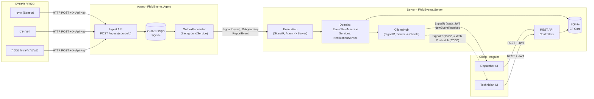
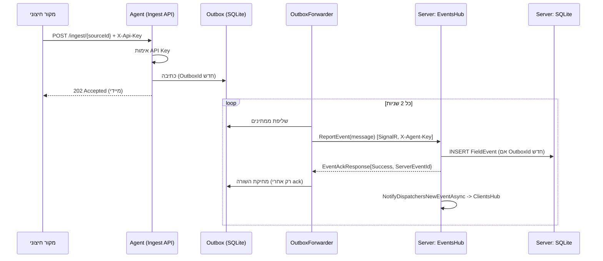
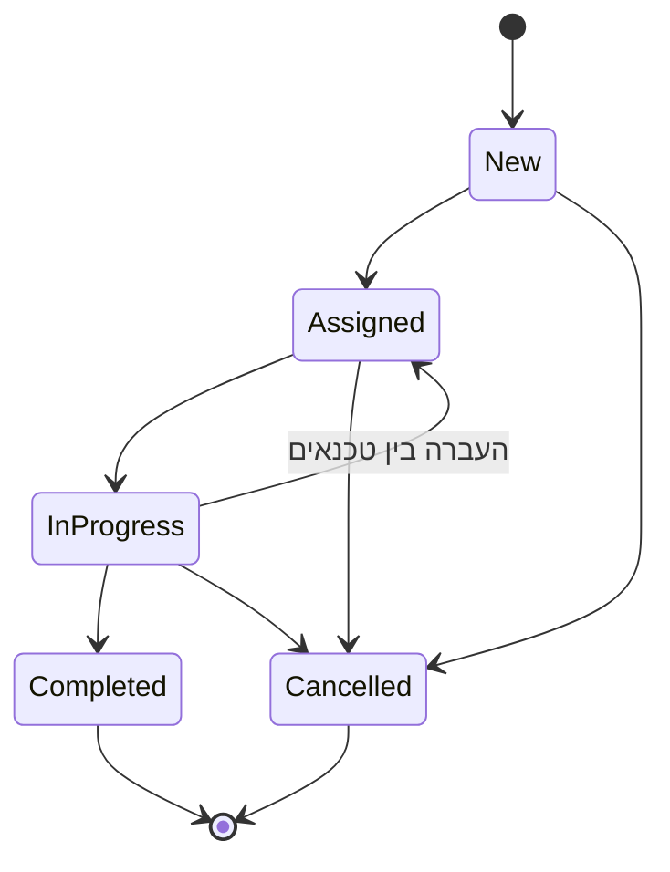
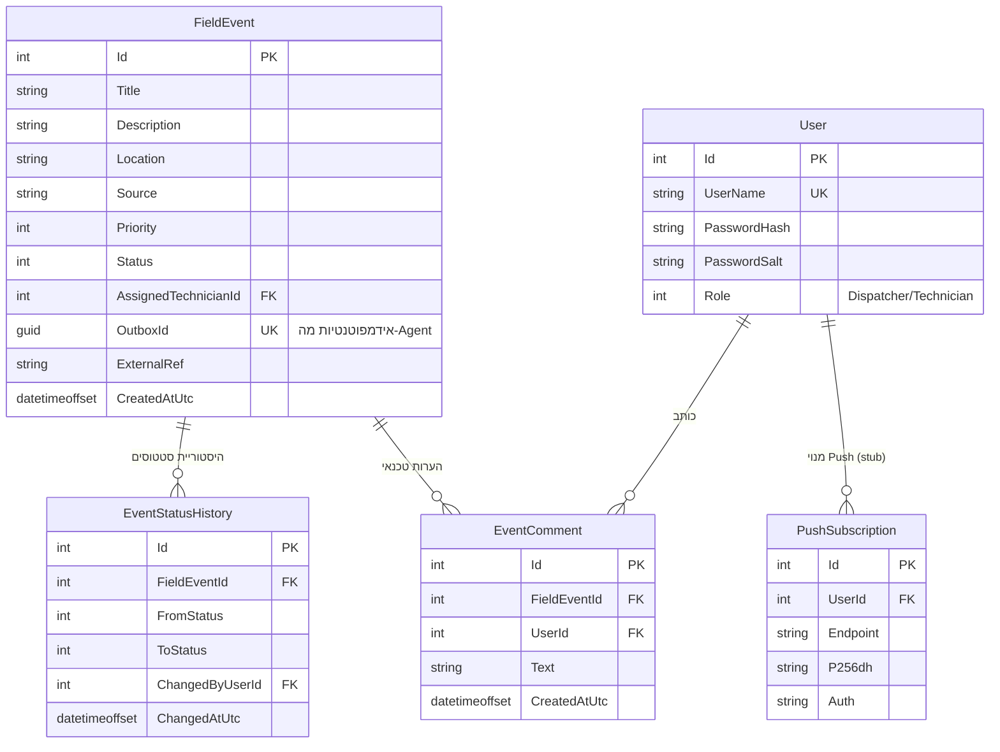

# מסמך ארכיטקטורה - Field Events Management

מסמך זה ברמה עליונה, ומטרתו להציג את ההחלטות המרכזיות, גבולות האחריות בין הרכיבים, וההנמקה
מאחורי הבחירות הטכנולוגיות. לפרטי מימוש מלאים - הקוד עצמו הוא מקור האמת (`src/`), ולהוראות הרצה -
ראו [`README.md`](../README.md).

## 1. תרשים ארכיטקטורה של כלל המערכת

**זרימת ה-Flow הנדרש (מודגש בתרשים):** מקור חיצוני → `Ingest API` → `Outbox` → `OutboxForwarder`
→ `EventsHub` → `EventStateMachine`/DB → `ClientsHub` → `Dispatcher UI`.

## 2. תיאור הרכיבים ותפקידם

| רכיב | תפקיד | גבול אחריות |
|---|---|---|
| **Agent** (`FieldEvents.Agent`) | נקודת הכניסה למקורות חיצוניים; מבטיח שאף אירוע לא יאבד עד שהשרת אישר קבלתו. | **לא** מחזיק לוגיקה עסקית (State Machine, הרשאות) - רק העברה אמינה. אחראי בלעדית על אימות המקורות ועל ה-retry/outbox. |
| **Server** (`FieldEvents.Server`) | "מקור האמת" - הלוגיקה העסקית, ה-State Machine, ההרשאות, ה-DB, וההפצה בזמן אמת ללקוחות. | היחיד שכותב ל-DB המרכזי ומחליט אם מעבר סטטוס חוקי. לא יוזם קשר למקורות חיצוניים - רק מקבל מה-Agent. |
| **Client** (`FieldEvents.Client`, Angular) | ממשק לסדרן ולטכנאי; מציג מידע ומאזין לעדכונים בזמן אמת. | לא אוכף הרשאות (זה תפקיד השרת) - רק מציג לפי מה שה-API/Hub מחזירים. |
| **Outbox מקומי** (בתוך ה-Agent) | תור עמיד-לכשל בין קליטת האירוע להעברתו לשרת. | ייעודי ל-Agent בלבד, לא משותף עם ה-DB של השרת. |
| **SignalR Hubs** (`EventsHub`, `ClientsHub`) | שני ערוצי real-time נפרדים בכוונה: אחד ל-Agent→Server, אחד ל-Server→Clients, עם סוגי אימות שונים לגמרי (ראו §6). | כל Hub אחראי רק על צד אחד של התקשורת - אין ערבוב בין "שירות פנימי" ל"משתמש קצה". |

## 3. תיאור מפורט של ה-Agent

### איך מתקבלים אירועים

ה-Agent חושף endpoint גנרי אחד לכל מקור: `POST /ingest/{sourceId}`, עם body בפורמט אחיד
(`IncomingEventRequest`: כותרת, תיאור, מיקום, עדיפות) וכותרת `X-Api-Key`. `SourceRegistry` מאמת
את המפתח מול רשימת מקורות רשומים ב-config - מקור לא מוכר/מפתח שגוי מקבל `401`.

### מה קורה ברגע הקבלה

הנקודה הקריטית: ה-**ack למקור החיצוני קורה לפני** שהאירוע הגיע לשרת (מחזיר 202 מיד אחרי כתיבה
ל-outbox המקומי). זה מה שמאפשר למקור לקבל תגובה מהירה גם כששרת המרכזי איטי/לא זמין, ואת האמינות
מבטיח ה-outbox, לא הקישור החי.

### מנגנון התקשורת עם השרת ומדוע

`OutboxForwarder` (`BackgroundService`) מחזיק `HubConnection` (SignalR client) עם
`WithAutomaticReconnect()` מול `EventsHub`, וקורא ל-method `ReportEvent` על כל אירוע.

**נבחר SignalR ולא REST רגיל** כי: (א) החיבור נשאר פתוח - אין overhead של handshake לכל הודעה,
מתאים ל"הודעות קצרות בזמן אמת"; (ב) דו-כיווני מטבעו - פתח לעתיד שבו השרת "יכול לדבר בחזרה" ל-Agent
(למשל: הוראת ניתוק, בקשת סטטוס); (ג) `WithAutomaticReconnect` נותן resilience "בחינם".
המחיר: ניהול חיבור stateful, ותלות בזמינות ה-Hub (מטופל ב-outbox, לא ב-SignalR עצמו).

**שתי חלופות שנשקלו ונדחו** למימוש ה-Agent עצמו (לא רק לפרוטוקול):

1. **Azure Functions / serverless** - נדחה כי פונקציות קצרות-חיים לא מתאימות לחיבור SignalR
   מתמשך או ל-state מקומי (outbox) ששורד בין קריאות.
2. **Windows Service קלאסי** (`System.ServiceProcess`) - נדחה כי Worker Service המודרני
   (Generic Host) נותן את אותה יכולת פריסה, עם DI/Config/Logging מובנים וקוד ניתן לתחזוקה יותר.

**הבחירה הסופית:** .NET Worker Service (`Microsoft.NET.Sdk.Web`, Generic Host), משלב
`BackgroundService` (ה-forwarder) עם Minimal API מוטמע (ה-ingest endpoint) באותו תהליך.

### הוספת מקור חדש

שורה נוספת במקטע `Sources` ב-`appsettings.json` (מזהה + מפתח API) - ללא שינוי קוד, כל עוד המקור
שולח JSON בפורמט האחיד. מקור עם מבנה נתונים שונה ידרוש שכבת מיפוי קטנה לפני הכנסה ל-outbox; שאר
הצנרת (retry, אימות, forwarding) נשארת זהה.

## 4. State Machine של האירוע

המעברים מוגדרים במפורש כמפה (`EventStateMachine.AllowedTransitions`) - כל מעבר שלא רשום שם נדחה
עם `InvalidEventTransitionException`. שינוי סטטוס אפשרי **רק** דרך `FieldEvent.TransitionTo(...)`
(ה-setter של `Status` הוא `private`), וכל מעבר נרשם ב-`EventStatusHistory` (מצב קודם, מצב חדש, מי
ביצע, מתי) - זו ההיסטוריה שמוצגת ב-UI. מכוסה ב-20 unit tests (`tests/FieldEvents.Server.Tests`):
כל מעבר חוקי, כל מעבר לא חוקי, ושרשור מעברים מלא.

## 5. מודל נתונים (ERD)

`FieldEvent.OutboxId` הוא Unique Index - זה מה שמונע יצירת אירוע כפול אם ה-Agent שולח שוב אירוע
שכבר עובד בעבר (ack שאבד). `PushSubscription` קיימת כסכימה מוכנה למימוש Web Push עתידי (ראו §7).

## 6. מנגנון אבטחה ואימות

| ערוץ | מנגנון | נימוק |
|---|---|---|
| משתמש קצה → Server (REST + `ClientsHub`) | JWT Bearer; ב-SignalR מועבר כ-query string (`access_token`) כי דפדפן לא יכול לשלוח header מותאם ב-WebSocket handshake | מתאים ל-SPA stateless; claim `role` (`Dispatcher`/`Technician`) נאכף **רק בצד השרת** עם `[Authorize(Roles=...)]` - לא באמון על ה-UI |
| Agent → Server (`EventsHub`) | Scheme נפרד: `AgentApiKeyAuthenticationHandler`, מפתח קבוע בכותרת `X-Agent-Key` | מבדיל בבירור בין "שירות פנימי מהימן" לבין משתמש אנושי - אינו יכול "להתחזות" למשתמש ולהפך |
| מקור חיצוני → Agent | `X-Api-Key` per-source מול `SourceRegistry` | כל מקור מזוהה ומבוקר בנפרד; מפתח שנפגם ניתן לביטול נקודתי |
| כל הערוצים | HTTPS/WSS | Kestrel + HTTPS redirection; בפיתוח - `dotnet dev-certs https --trust` |

אומת ידנית: בקשה עם JWT של טכנאי ל-endpoint שמוגבל לסדרנים (`GET /api/events`) מחזירה `403`;
בקשה ללא טוקן מחזירה `401`.

## 7. התנהגות המערכת כשרכיב לא זמין

| תרחיש | מה קורה |
|---|---|
| **השרת המרכזי נופל** | ה-Agent ממשיך לקבל אירועים חדשים (`202 Accepted`) ולכתוב אותם ל-**outbox מקומי** (SQLite נפרד, `agent-outbox.db`). `WithAutomaticReconnect()` מנסה reconnect עם backoff; כשהוא מתייאש, הלולאה הראשית ב-`OutboxForwarder` ממשיכה לנסות `StartAsync` כל 2 שניות ללא הגבלת זמן. עם חזרת השרת - כל האירועים הממתינים נשלחים אוטומטית, ללא התערבות ידנית. **מאומת בפועל** (ראו README): אירוע שנשלח בזמן שהשרת היה למטה הופיע ב-DB תוך שניות מרגע ההפעלה מחדש. |
| **ה-Agent עצמו קורס/מופעל מחדש** | האירועים שעדיין לא קיבלו ack נשארים ב-outbox על הדיסק (לא בזיכרון) - עם עלייה מחדש, `OutboxForwarder` ממשיך לרוקן אותם. שום אירוע לא הולך לאיבוד גם אם הקריסה קרתה רגע לפני השליחה. |
| **אירוע נשלח פעמיים** (Agent שלח מחדש כי לא ראה ack) | `OutboxId` הוא מפתח אידמפוטנטיות ייחודי ב-DB - `EventsHub.ReportEvent` מזהה כפילות ומחזיר את אותו `ServerEventId` בלי רשומה נוספת. |
| **משתמש קצה מנותק (דפדפן סגור)** | מתוכנן כ-Web Push, כרגע stub מתועד (`WebPushNotificationChannel`) - ראו §8. הודעה ל"מחובר" מגיעה תמיד; ל"מנותק" רק תירשם בלוג כרגע. |
| **חיבור SignalR של דפדפן נופל** (`ClientsHub`) | `ConnectionManager` מסיר את החיבור ב-`OnDisconnectedAsync`; הלקוח (Angular, `withAutomaticReconnect`) מנסה reconnect בעצמו. |

## 8. Trade-offs ובחירות טכנולוגיות מרכזיות

| החלטה | המחיר ששולם | מה התקבל בתמורה |
|---|---|---|
| SignalR (לא REST פשוט) בין Agent ל-Server | ניהול חיבור stateful, מורכבות רבה יותר מ-`HttpClient` + Polly | Real-time אמיתי, ערוץ דו-כיווני לעתיד, reconnect מובנה |
| SQLite (לא SQL Server) ל-DB של השרת | פחות מתאים לעומס/concurrency גבוה בסביבת production | "clone and run" מיידי בלי התקנה - מתאים לנפח הנתונים הקטן שתואר בדרישות |
| Outbox מקומי נפרד (SQLite) בתוך ה-Agent | טבלה/קוד נוספים לתחזק, שני מסדי נתונים בפרויקט | אירוע לעולם לא הולך לאיבוד - לא בנפילת שרת, לא בקריסת Agent |
| Web Push כ-stub מתועד ולא מומש | המסלול "משתמש מנותק" לא עובד בפועל כרגע | מיקוד מלא באיכות ה-Flow הנדרש (E2E), בהתאם לדרישות הפרויקט ("אין חובה לממש את כלל מנגנוני ההתראות") |
| JWT Bearer (לא Cookie/Session) | ניהול ידני של expiry/refresh (לא ממומש refresh token בשלב זה) | Stateless, מתאים טבעי ל-SPA + SignalR, אין תלות ב-server-side session store |
| State Machine כ-class סטטי ללא DI | פחות "אניברסלי" מבחינת testability עם mocking frameworks | פשוט ככל האפשר לבדוק (pure functions), בלתי אפשרי לעקוף בטעות כי `FieldEvent.Status` הוא `private set` |
